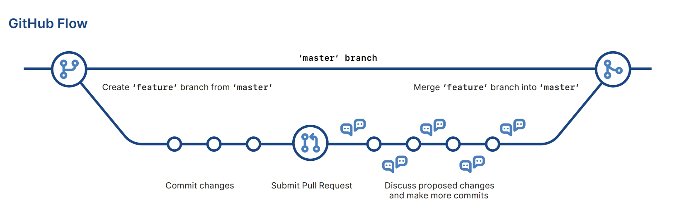

# What is Git?

Git is a tool used to keep track of changes to files, especially the code of projects. It is termed a distributed version control system because it allows multiple people to work on the same project, even if they are not connected to a common server.

Created by Linus Torvalds in 2005 for the development of the Linux kernel, Git helps you manage changes to your code over time. It keeps track of every change or update, so you can always look back at previous versions or undo mistakes if needed.

## Features of Git

- **Version Control System:** Git tracks every change to your project files. You can revert to previous versions if needed.
- **Repositories:** A Git repository (or repo) is a project's central hub where everything related to your work is stored and managed. There are two main types:
  - **Local Repository:** Stored on your computer. You can work on your project and make changes here.
  - **Remote Repository:** Stored on a server (e.g., GitHub). You and others can share and work on the project here.
- **Commits:** Each time you make changes and save them, these are called commits. Git tracks all commits you have made.
- **Branches:** Allows you to create branches to work on new features and fixes. For example, a “main” branch for stable code and a “feature” branch for new developments.
- **Merging:** You can merge branches into the main branch to incorporate changes made in other branches.
- **Cloning:** Creates a complete copy of a Git repository. It’s like copying the entire project from a central location to your own computer.



---

## Reasons to Choose Git

- **Distributed System:** Every developer has a complete local copy of the project, allowing for offline work and increased resilience.
- **Performance:** Git is fast and efficient, handling large projects with ease.
- **Branching and Merging:** Lightweight branching and easy merging facilitate parallel development and feature isolation.
- **Collaboration:** Tools like GitHub enhance team collaboration, code reviews, and project management.
- **Track Changes:** Git maintains a history of changes, making it easy to revert to previous versions.

## Steps to Setup Git

1. **Install Git:** Download and install Git from the official Git website.
2. **Configure Git:** Set up your username and email.
   ```bash
   git config --global user.name "Your Name"
   git config --global user.email "your.email@example.com"
   ```
3. **Create a Repository:** Initialize a Git repository in your project directory.
   ```bash
   git init
   ```
4. **Make Your First Commit:** Add files to the staging area and commit your changes.
   ```bash
   git add .
   git commit -m "Initial commit"
   ```

## Basic Git Commands

- `git init`: Initializes a new Git repository.
- `git clone [URL]`: Clones a remote repository to your local machine.
- `git add [file]`: Stages changes to be committed.
- `git commit -m "message"`: Commits the staged changes with a message.
- `git push`: Pushes your commits to a remote repository.
- `git pull`: Fetches and merges changes from a remote repository to your local repository.
- `git status`: Shows the status of changes in your working directory.

## Advantages of Git

- **Distributed System:** Full project history is available on every developer's computer, allowing for offline work and eliminating single points of failure.
- **Fast:** Handles large projects quickly and efficiently.
- **Branching and Merging:** Facilitates feature development and integration without affecting the main project.
- **Collaboration:** Enhances teamwork, code reviews, and project management.
- **Change Tracking:** Records all changes, allowing easy reversion to previous versions.
- **Free and Open Source:** No cost to use, with a large community for support.

## Disadvantages of Git

- **Learning Curve:** Complex to learn, especially for beginners.
- **Complex Commands:** Some commands can be difficult to understand and remember.
- **Merge Conflicts:** Resolving conflicts during merges can be challenging.
- **Storage:** Local repositories can take up significant space.
- **Setup and Configuration:** Initial setup can be time-consuming.
- **Not Ideal for Large Binary Files:** Less efficient with large binary files (e.g., videos, images).

## Git Workflow

A common Git workflow includes:

1. **Clone Repository:**
   ```bash
   git clone git@github.com:username/repository.git
   ```
2. **Create Branch:**
   ```bash
   git checkout -b feature-branch-name
   ```
3. **Check Status:**
   ```bash
   git status
   ```
4. **Stage Changes:**
   ```bash
   git add filename or git add .
   ```
5. **Commit Changes:**
   ```bash
   git commit -m "Add feature X"
   ```
6. **Push Branch:**
   ```bash
   git push origin feature-branch-name
   ```
7. **Create Pull Request:** On GitHub/other service.
8. **Update Local Repository:**
   ```bash
   git checkout main
   git pull origin main
   ```
9. **Delete Branch:**
   ```bash
   git branch -d feature-branch-name
   git push origin --delete feature-branch-name
   ```

## Git – FAQs

**What is Git and why is it used?**
Git is a distributed version control system that allows multiple people to work on the same project without interfering with each other’s changes. It helps manage and track changes to code, facilitate collaboration, and handle project histories efficiently.

**What are branches in Git?**
Branches are used to manage and organize different lines of development within a project. They allow you to work on different versions of your project simultaneously.

**What is a repository in Git?**
A repository is a storage space where your project’s files and their history are kept. It includes all files and directories related to your project, as well as their change history. Repositories can be local or remote.

**What is a Pull Request (PR) in Git?**
A Pull Request (PR) is a request to merge changes from one branch into another, typically from a feature branch into the main branch. It allows team members to review and discuss the changes before integration.

**What is the difference between Git and GitHub?**
Git is the version control system that tracks changes in your code and manages different versions. GitHub is a web-based platform that uses Git to provide cloud storage for repositories and collaboration tools.

---

NEXT -> [Working with Git](GitCMD.md).
